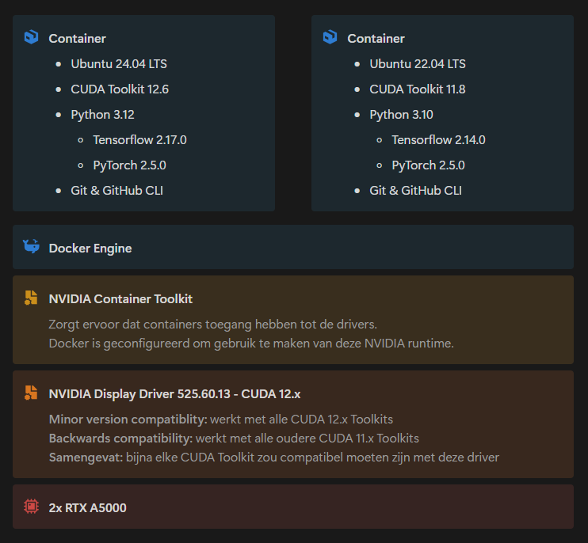

# Devcontainer Template

This is an up-to-date **Devcontainer** template for developing **Python** projects on a **GPU** enabled machine, specifically with **TensorFlow** and **PyTorch** support.

## Instructions

1. Clone this repository to your server.
2. Press `Ctrl+Shift+P` to open the command palette.
3. Search for `Dev Containers: Rebuild and Reopen in Container`.
4. Follow the instructions in the terminal to install TensorFlow or PyTorch.
5. You are now ready to start developing with GPU support! 😀

## Devcontainer info

### Base OS

| Name   | Version | Image                                                                                                                  |
| :----- | :------ | :--------------------------------------------------------------------------------------------------------------------- |
| Ubuntu | 24.04   | [mcr.microsoft.com/devcontainers/base:ubuntu-24.04](https://github.com/devcontainers/images/tree/main/src/base-ubuntu) |

### Features

| Name        | Version             | Image                                                                                                               |
| :---------- | :------------------ | :------------------------------------------------------------------------------------------------------------------ |
| NVIDIA CUDA | CUDA 12.6 & cuDNN 9 | [ghcr.io/devcontainers/features/nvidia-cuda:1](https://github.com/devcontainers/features/tree/main/src/nvidia-cuda) |
| Python      | 3.12                | [ghcr.io/devcontainers/features/python:1](https://github.com/devcontainers/features/tree/main/src/python)           |
| Git         | Latest              | [ghcr.io/devcontainers/features/git:1](https://github.com/devcontainers/features/tree/main/src/git)                 |
| GitHub CLI  | Latest              | [ghcr.io/devcontainers/features/github-cli:1](https://github.com/devcontainers/features/tree/main/src/github-cli)   |

### Libraries

| Name       | Version | Description                                         |
| :--------- | :------ | :-------------------------------------------------- |
| TensorFlow | 2.17.0  | AI development framework                            |
| PyTorch    | 2.5.0   | AI development framework                            |
| Poetry     | Latest  | Venv-like solution with great dependency management |

### Extensions

| Name     | Description             | ID                        |
| :------- | :---------------------- | :------------------------ |
| Python   | Python language support | ms-python.python          |
| Pylint   | Static code analyser    | ms-python.vscode-pylint   |
| Black    | Code formatter          | ms-python.black-formatter |
| Jupyter  | Jupyter extension pack  | ms-toolsai.jupyter        |
| Prettier | Code formatter          | esbenp.prettier-vscode    |

## Common errors

If the shell scripts fail to run or complain about `\r` characters, check if the `End of Line` formatting of the scripts is set to `LF`.

## Versioning

| CUDA Toolkit | Linux Driver Version | Windows Driver Version |
| :----------- | :------------------- | :--------------------- |
| CUDA 12.x    | >= 525.60.13         | >= 527.41              |
| CUDA 11.x    | >= 450.80.02         | >= 452.39              |

- The CUDA Toolkits have **minor version compatibility** with the drivers. 
  _This means that CUDA Toolkit 12.6 should work with a driver that's designed for CUDA 12.0 because they have the same major version._
- The CUDA Toolkits are **backwards compatible** with the drivers. 
  _This means that CUDA Toolkit 11.8 will still work with a newer driver that's designed for CUDA 12.x versions._

| Latest version    | Python version | CUDA |
| :---------------- | :------------- | :--- |
| TensorFlow 2.17.0 | 3.9-3.12       | 12.3 |
| PyTorch 2.5.0     | 3.9-3.12       | 12.4 |

The most recent common Python version is **3.12**.

## GPU accelerated containers

The **hosts NVIDIA driver** gets passed to the container using the **[NVIDIA Container Toolkit](https://docs.nvidia.com/datacenter/cloud-native/container-toolkit/latest/index.html)**.
You can validate your Container Toolkit installation by checking the **Docker daemon** configuration file on your server: `/etc/docker/daemon.json`.
To spin up a GPU-accelerated container, append the `--gpus=all` and `--runtime=nvidia` arguments to your `docker run` command.
Luckily, these arguments are already preconfigured in `devcontainer.json`.

The **NVIDIA driver** on the A5000 server has version **12.0**. 
A GPU-enabled container requires the **NVIDIA CUDA Toolkit** (contains cuFFT, cuBLAS, etc.) and **cuDNN** in the container itself. 

